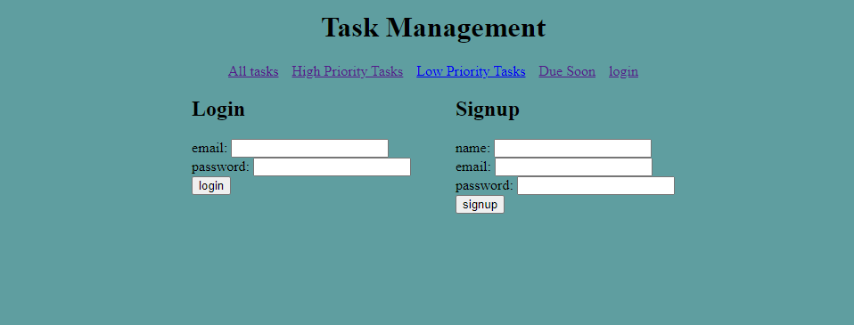
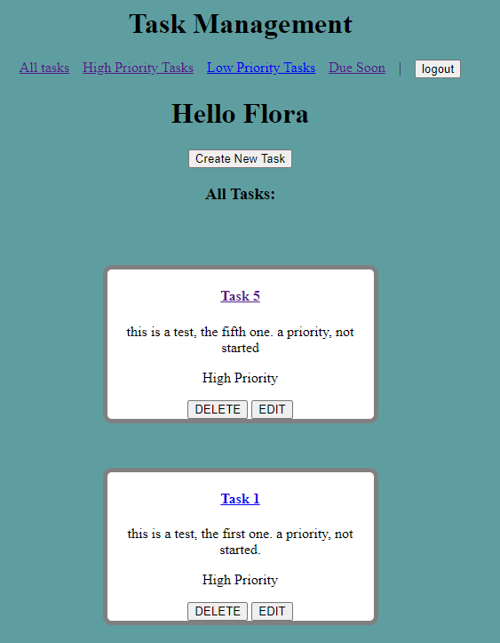
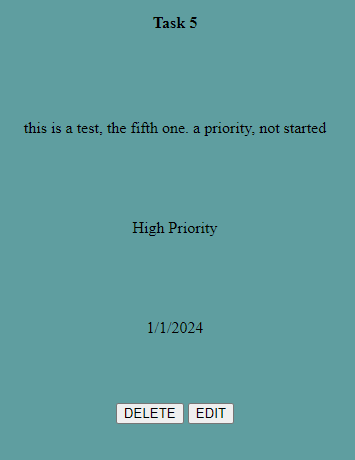
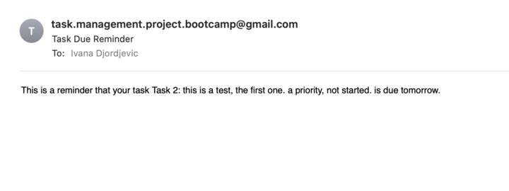

# personal task management system

## Table of Contents

- [Description](#description)
- [Installation](#installation)
- [Usage](#usage)
- [License](#license)
- [Credit](#credit)
- [Project-Proposal](#project-proposal)

## Description

This is an app to keep track of your tasks. You can assign them a due date and a priority. And you can also choose to receive a notificatino the day before a task is due.

screenshots: 
 
 
 
 

[deployed heroku link](https://task-managementt-6e5cfd5db620.herokuapp.com/login) 

## Installation

- bcrypt
- connect-session-sequelize
- dotenv
- express
- express-handlebars
- express-session
- mysql2
- nodemailer
- nodemailer-smtp-transport
- sequelize

## Usage

A blog where the user can easily keep track of their tasks.

## License

This application is covered under: MIT License.

## Credit

Ivana Djordjevic, Mack Dixon, Manraj Uppal

## project proposal

- name: personal task management system
- team members: Mack, Manraj, Ivana
- MVP project description: 
    - an app to keep track of your tasks
    - can categorize tasks with different priorities
    - can set a complete, in-progress, or not started status
    - can set a due date
    - can edit and/or delete tasks
    - can add a no
    - add task notifications (either through text, or email or browser API)
