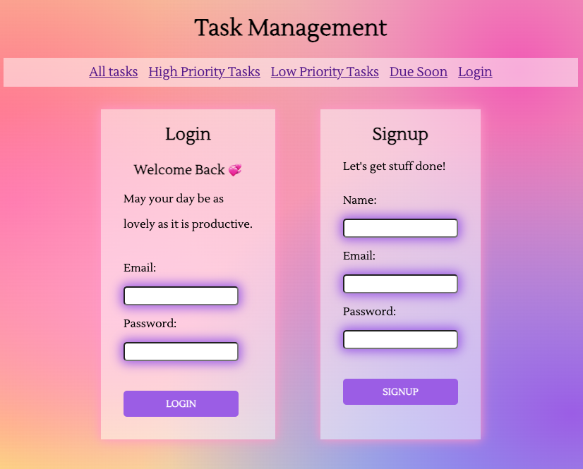

# personal task management system

## Table of Contents

- [Description](#description)
- [Installation](#installation)
- [Usage](#usage)
- [License](#license)
- [Credit](#credit)

## Description

A program built on the MVC architecture utilizing Node.js, Express.js, Express-Handlebars, MySQL, Sequelize, and Nodemailer.  
Designed for task management, allowing users to set deadlines and priorities for tasks, with an optional feature to receive a notification a day prior to the task's due date.

screenshots: 
 
 
 

[deployed heroku link](https://task-managementt-6e5cfd5db620.herokuapp.com/login) 

## Installation

- bcrypt
- connect-session-sequelize
- dotenv
- express
- express-handlebars
- express-session
- mysql2
- nodemailer
- nodemailer-smtp-transport
- sequelize

## Usage

A blog where the user can easily keep track of their tasks.

## License

This application is covered under: MIT License.

## Credit

Ivana Djordjevic, Mack Dixon, Manraj Uppal